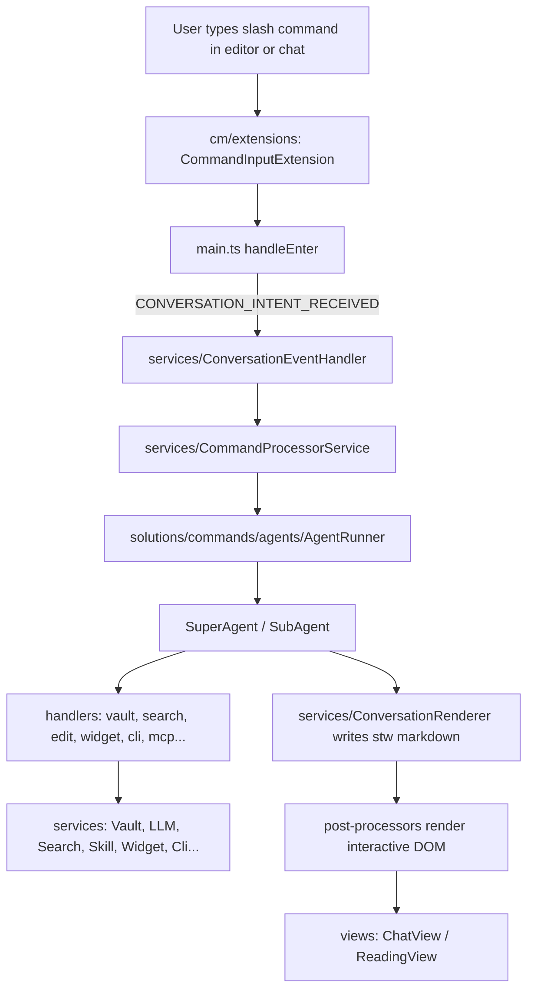

# AGENTS.md

## Project Overview

Steward is an autonomous AI agent for Obsidian, powered by Large Language Models (LLMs). It provides search, vault management, skills, subagents, MCP, shell/terminal, widgets, and user-defined command workflows — all embedded in Obsidian's editor and reading views.

See [README.md](README.md) for user-facing features and installation.

## Repository Map

| Path               | Purpose                                                                 |
| ------------------ | ----------------------------------------------------------------------- |
| `src/`             | Plugin source (TypeScript)                                              |
| `scripts/`         | Build-time bundlers (libs, skills, UDCs, sub-agents) → `src/generated/` |
| `community-UDCs/`  | Community user-defined command definitions                              |
| `standard-skills/` | Built-in skills bundled into the plugin                                 |
| `agents/`          | Default `Sub Agents.md` bundled into the plugin                         |
| `docs/`            | Technical documentation                                                 |
| `main.js`          | Production bundle (esbuild output)                                      |
| `styles.css`       | Compiled CSS (PostCSS output)                                           |

## Source Layout (`src/`)

| Folder             | Role                                                                           | AGENTS.md                                                      |
| ------------------ | ------------------------------------------------------------------------------ | -------------------------------------------------------------- |
| `main.ts`          | Plugin entry: lazy service getters, `registerStuffs()`, command Enter handling | —                                                              |
| `services/`        | Business logic (no conversation wiring)                                        | [src/services/AGENTS.md](src/services/AGENTS.md)               |
| `solutions/`       | Feature subsystems: agents, search, artifacts, PTY                             | [src/solutions/AGENTS.md](src/solutions/AGENTS.md)             |
| `post-processors/` | Markdown post-processors for Steward syntax → interactive DOM                  | [src/post-processors/AGENTS.md](src/post-processors/AGENTS.md) |
| `cm/extensions/`   | CodeMirror extensions: command input, autocomplete, inline widgets             | [src/cm/extensions/AGENTS.md](src/cm/extensions/AGENTS.md)     |
| `views/`           | ChatView, ReadingView, view-builders                                           | [src/views/AGENTS.md](src/views/AGENTS.md)                     |
| `settings/`        | Settings tab and schema migrations                                             | —                                                              |
| `database/`        | IndexedDB search database (`SearchDatabase`)                                   | —                                                              |
| `lib/modelfusion/` | Embedding classifier for intent/tool routing                                   | —                                                              |
| `tools/`           | Obsidian API helpers, media tools                                              | —                                                              |
| `types/`           | Shared TypeScript types and events                                             | —                                                              |
| `utils/`           | Cross-cutting utilities (logger, retry, date, etc.)                            | —                                                              |
| `constants/`       | Shared constants                                                               | —                                                              |
| `i18n/`            | Internationalization locales                                                   | —                                                              |
| `generated/`       | Build-time generated payloads (do not edit by hand)                            | —                                                              |

The agent subsystem deep dive lives in [src/solutions/commands/AGENTS.md](src/solutions/commands/AGENTS.md).

## End-to-End Command Flow



**Entry chain:**

1. `src/main.ts` — parses `/` command block on Enter, emits `Events.CONVERSATION_INTENT_RECEIVED`
2. `src/services/ConversationEventHandler.ts` — listens, dispatches intents
3. `src/services/CommandProcessorService.ts` — wraps `AgentRunner` + intent validation
4. `src/solutions/commands/agents/AgentRunner.ts` — sequential intent processing, pause/resume
5. `src/solutions/commands/Agent.ts` — `safeHandle`: sanitize, load model/tools, fallback
6. `SuperAgent` / `SubAgent` — tool resolution, handler dispatch, multi-step loop
7. `src/services/ConversationRenderer` — writes conversation markdown (`stw-*` callouts, artifacts)
8. Post-processors — render interactive UI in preview/reading
9. Views — ChatView / ReadingView shells

## Vault Folder Structure

Steward creates a `Steward/` folder in the vault (configurable via settings):

```
Steward/
├── Commands/       # User-defined command definitions (YAML in markdown)
├── Conversations/  # Archived conversation notes
├── MCP/            # MCP server definitions
├── Memory/         # Persistent tool instructions
├── Rules/          # Guardrails rules
├── Skills/         # Agent skills (Agent Skills spec compatible)
├── Widgets/        # HTML widget projects
├── Artifacts/      # Saved .art notes
├── Trash/          # Soft-deleted files
├── Sub Agents.md   # Sub-agent definitions
└── Chat.md         # Active chat note
```

## Commands

```bash
npm run dev          # Watch build + regenerate UDC/skills/sub-agents manifests
npm run build        # Typecheck + production build
npm run test         # Jest unit tests
npm run lint         # ESLint
npm run lint:fix     # ESLint with auto-fix
npm run format       # Prettier
npm run format:check # Prettier check
```

**Build scripts** (`scripts/*.mjs`) generate `src/generated/*` consumed at compile time. See [scripts/AGENTS.md](scripts/AGENTS.md).

`npm run build:bundled-libs` is manual — regenerates LZ-compressed lib payloads after changing bundled-lib entry files.

## Conventions

- **Return early** — avoid deep nesting
- **Single object param** when a function has more than 4 arguments
- **i18n** — user-facing strings in `src/i18n/locales` via `getBundledInternal('i18n')`; exceptions: system prompts, logging, errors
- **No `console.*`** — use `src/utils/logger`
- **Co-located tests** — `*.test.ts` beside implementation
- **Vault watchers** — register from `onLayoutReady`, not plugin `onload` (avoids startup storms)
- **`for` loops** over `forEach`; dot notation over destructuring for object fields
- **Singleton services** — `getInstance(plugin)` pattern; lazy getters on `StewardPlugin` in `main.ts`
