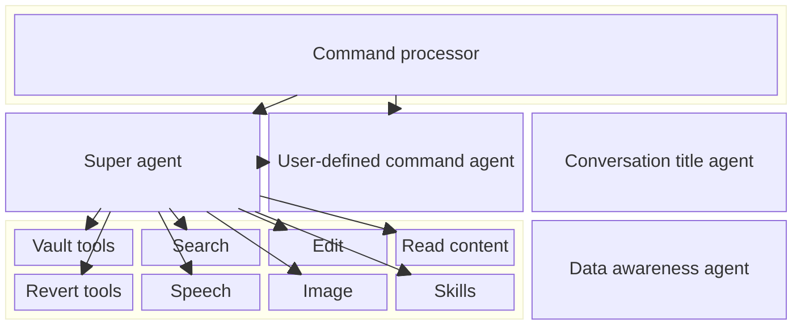
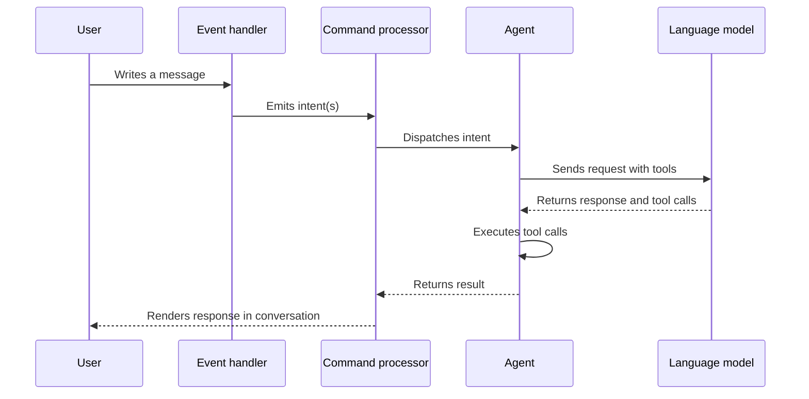
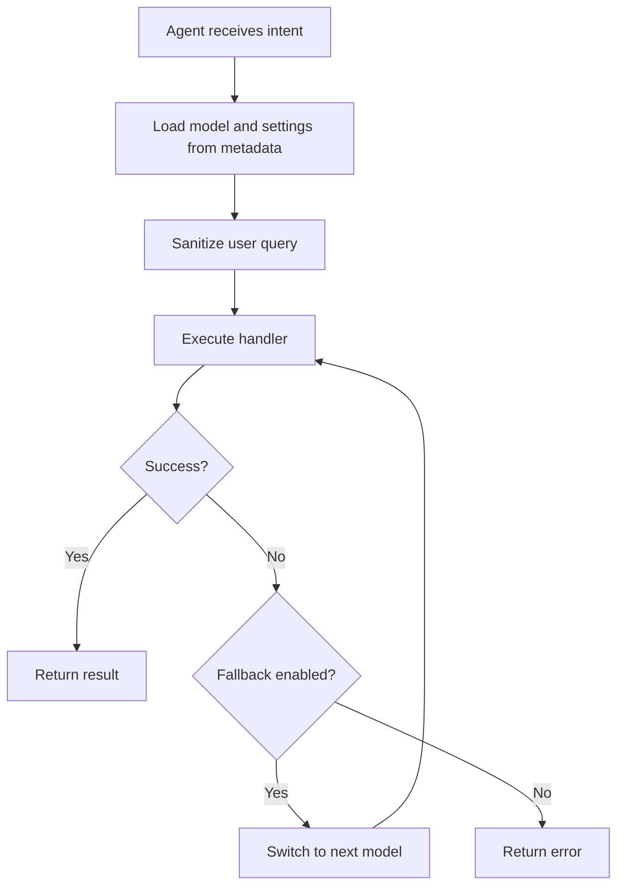
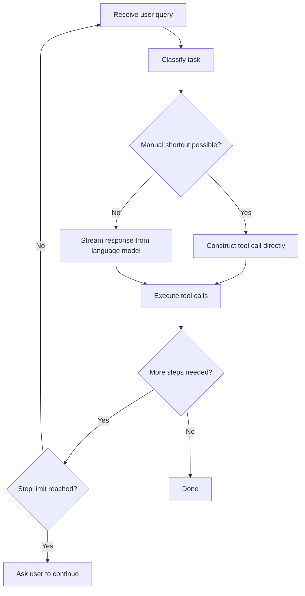
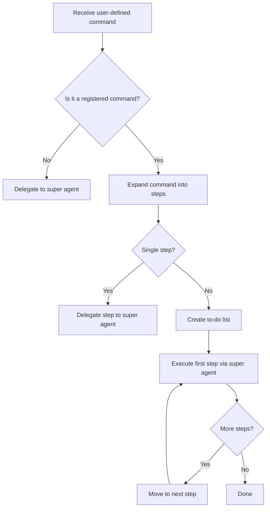
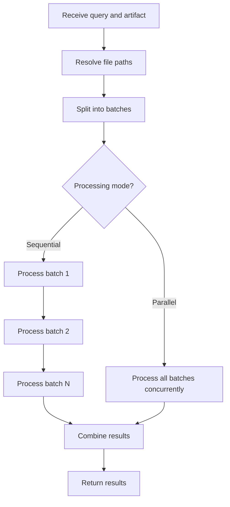
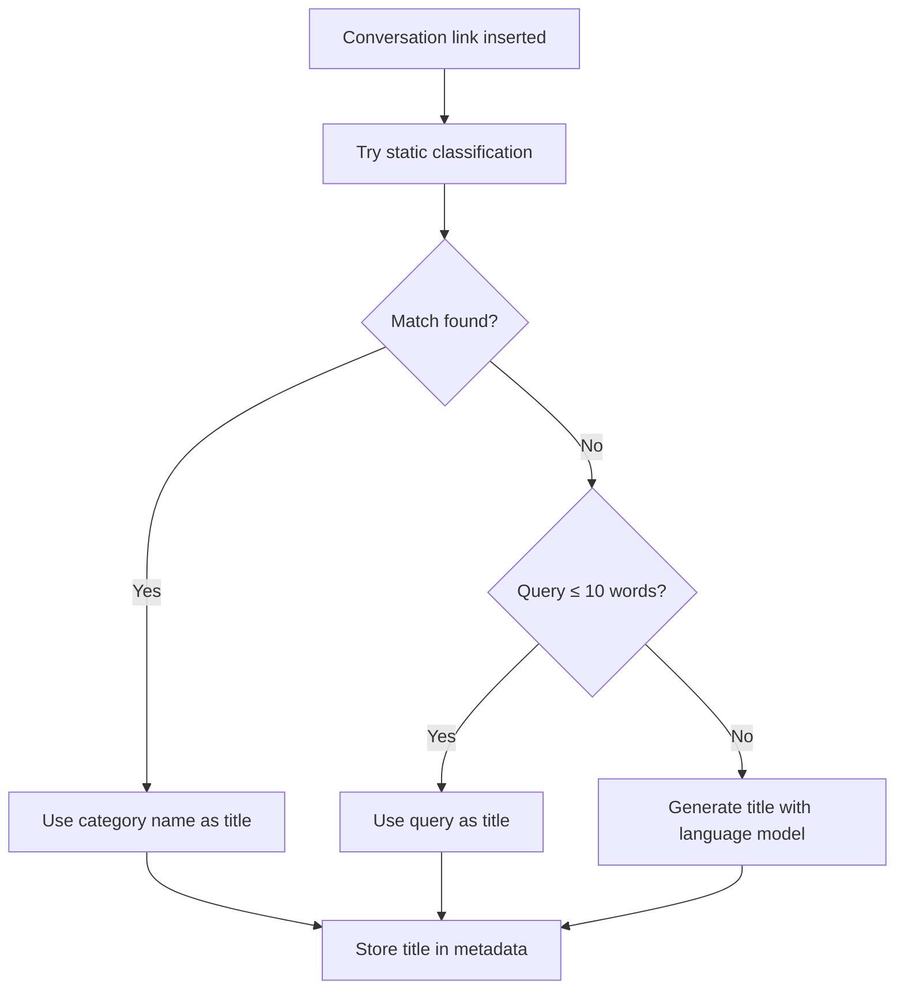

# Agents architecture

## Overview

The plugin uses an agent-based architecture to handle user requests inside conversations. When a user sends a message, the system parses it into one or more intents, dispatches each intent to the appropriate agent, and the agent carries out the task using a set of tools.

There are four agents in the system:

- **Super agent** — The primary agent that handles most user requests. It classifies the user's intent, selects the right tools, streams responses from the language model, and orchestrates multi-step workflows.
- **User-defined command agent** — Handles custom commands defined by the user. It expands the command into a to-do list of steps and delegates each step to the super agent.
- **Data awareness agent** — A helper agent that processes large numbers of files in batches, sending them to the language model without exceeding token limits.
- **Conversation title agent** — A lightweight, fire-and-forget agent that generates a short title for each conversation and stores it in the note metadata.

## How it works

### Intent flow

Every user message goes through the same pipeline before reaching an agent.

1. The user writes a message in a conversation note.
2. The event handler detects the change and emits an event.
3. The event is parsed into one or more intents (each with a type and query).
4. The command processor receives the intents and processes them sequentially.
5. For each intent, the command processor finds the registered agent for that intent type and calls it.
6. The agent performs the task and returns a result status (success, error, needs confirmation, etc.).
7. The command processor acts on the result — it may pause for user confirmation, retry with a fallback model, or continue to the next intent.

### Agent registration

Agents are registered with the command processor at startup. Each registration maps an intent type to an agent instance. When a user-defined command is detected, the processor automatically routes to the user-defined command agent instead.

The following registrations exist:

- Default (empty type) — Super agent
- Search — Super agent with search tool pre-activated
- Speech — Super agent with speech tool pre-activated
- Image — Super agent with image tool pre-activated
- User-defined commands — User-defined command agent

### Base agent behavior

All agents share a common base that provides:

- Access to the plugin, renderer, settings, and vault tools.
- A safe execution wrapper that catches errors and attempts model fallback when a request fails.
- Automatic loading of conversation-level settings from note metadata (language, active tools, model, system prompts).
- Support for rendering loading indicators while processing.

---

## Super agent

The super agent is the central agent in the system. It handles the full lifecycle of a user request: classifying the task, selecting tools, calling the language model, processing tool calls, and looping through multi-step operations.

### How it works

1. **Task classification** — The agent first classifies the user's query to determine what kind of task it is (vault operation, search, edit, revert, etc.). Classification uses a combination of static keyword matching, prefix matching, and embedding-based clustering.
2. **Tool activation** — Based on the classified task, the agent activates the appropriate tools. Tools can also be pre-activated from conversation metadata or intent parameters.
3. **Manual tool call shortcut** — For certain well-defined tasks (help, stop, revert, search with a clear query), the agent skips the language model entirely and constructs the tool call directly.
4. **Language model streaming** — When the language model is needed, the agent streams the response. Text is rendered to the conversation in real time. Tool calls are extracted from the stream and executed after streaming completes.
5. **Tool call execution** — Each tool call is dispatched to the corresponding handler. Handlers perform the actual operation (create files, search, edit content, etc.) and return a result.
6. **Multi-step loop** — After processing tool calls, the agent checks if more work is needed (e.g., a to-do list has remaining steps). If so, it re-invokes itself with an incremented step counter, up to a configurable maximum.

### Task classification

The classifier maps user queries to task categories. Each category determines which tools are activated and whether a manual shortcut is available.

| Category | Description |
|---|---|
| Vault | File operations: create, list, delete, copy, move, rename, update metadata, grep |
| Search | Searching notes by keywords, properties, filenames, or folders |
| Edit | Modifying existing note content |
| Read | Reading note content |
| Revert | Undoing a previous operation |
| Speech | Generating audio from text |
| Image | Generating images |
| Build search index | Indexing vault files for search |

### Tool content streaming

For tools that produce large content (edit and create), the super agent supports streaming the tool's output to a temporary file in real time. This gives the user an immediate preview of the changes before the tool call finishes. Once the tool completes, the temporary preview is replaced with the final computed result.

### Handlers

The super agent delegates tool execution to specialized handlers. Each handler is responsible for one tool and is lazily instantiated on first use.

Handlers fall into several groups:

- **Vault operations** — Create, list, delete, copy, move, rename files; update metadata; grep for content.
- **Revert operations** — Undo create, delete, move, rename, frontmatter update, or edit operations using stored artifacts.
- **Content access** — Read note content (text, images, audio, video).
- **Edit** — Modify note content with a preview and confirmation flow.
- **Search** — Search the vault using keywords, filenames, folders, and properties.
- **Media generation** — Generate speech audio or images.
- **User interaction** — Ask for confirmation, request additional input, show help.
- **Workflow** — Manage to-do lists, activate tools, use skills, conclude operations.

---

## User-defined command agent

The user-defined command agent allows users to create their own multi-step commands. When invoked, it expands the command definition into a sequence of steps and orchestrates their execution through the super agent.

### How it works

1. The agent checks if the intent type matches a registered user-defined command.
2. If not, it falls back to the super agent directly.
3. For a valid command, the agent expands the command definition into a list of step intents.
4. For single-step commands, it delegates directly to the super agent with that one step.
5. For multi-step commands, it creates a to-do list from the steps and stores it in the conversation metadata.
6. It then starts executing the first step by delegating to the super agent.
7. After each step completes, the super agent checks the to-do list for remaining steps and continues automatically.

### To-do list management

Each step in the to-do list has a status: pending, in progress, completed, or skipped. The super agent updates the status after each step and determines the next step to execute. Steps can carry their own model, system prompts, and confirmation settings independent of other steps.

---

## Data awareness agent

The data awareness agent is a utility agent designed for tasks that need to process many files at once. It solves the problem of token limits by splitting files into batches and processing each batch separately.

### How it works

1. The caller provides a query, a reference to an artifact containing file paths, and a schema defining the expected output format.
2. The agent resolves the file paths from the artifact.
3. It splits the files into batches of a configurable size (default: 30 files per batch).
4. Each batch is sent to the language model along with the query and system prompt.
5. The language model returns structured results matching the provided schema.
6. Results from all batches are combined and returned to the caller.

Batches can be processed either sequentially or in parallel.

---

## Conversation title agent

The conversation title agent runs in the background whenever a new conversation link is inserted. Its sole purpose is to generate a human-readable title for the conversation.

### How it works

1. The event handler triggers the title agent in a fire-and-forget manner (it never blocks the main agent).
2. The agent first attempts static classification — if the user's query matches a known command pattern, the category name is used as the title (e.g., "Vault Rename").
3. If the query is short enough (10 words or fewer), it is used directly as the title.
4. Otherwise, the agent asks the language model to generate a concise title (at most 10 words).
5. The generated title is stored in the conversation note metadata.

---

## Key decisions

- **Classification before calling the language model.** The super agent classifies the user's query locally before deciding whether to involve the language model. This allows many common actions (help, stop, revert, simple searches) to execute instantly without waiting for a model response.
- **Manual tool call shortcuts.** When the intent is unambiguous (e.g., the user typed a known command or the query maps to exactly one task), the agent constructs the tool call directly. This avoids unnecessary round-trips to the language model.
- **Model fallback.** If a model request fails, the base agent can automatically switch to the next model in the fallback chain and retry. This improves reliability when using less stable providers.
- **Fire-and-forget title generation.** The title agent runs independently of the main processing pipeline. Even if it fails, the conversation continues normally.
- **Lazy handler instantiation.** Handlers are created only when first needed, keeping memory usage low when only a subset of tools is used in a session.
- **Batch processing for data-heavy tasks.** The data awareness agent avoids token limits by splitting work into manageable batches, making it feasible to process hundreds of files in a single operation.

## Important notes

- The command processor processes intents sequentially. If one intent fails, subsequent intents in the same batch are not executed.
- User-defined commands with multiple steps are automatically appended with a conclude instruction on the last step to ensure the agent loop terminates properly.
- Tool calls can trigger confirmation flows that pause processing. The command processor stores the pending state so it can resume when the user responds.
- Classification results are saved as embeddings to improve future classification accuracy over time.
