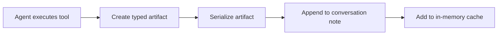
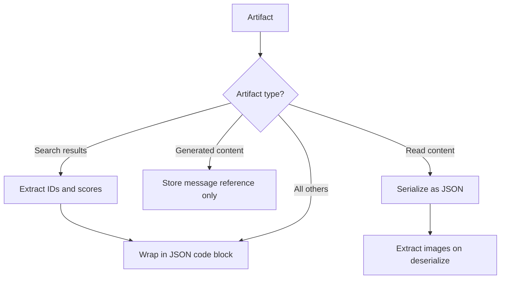
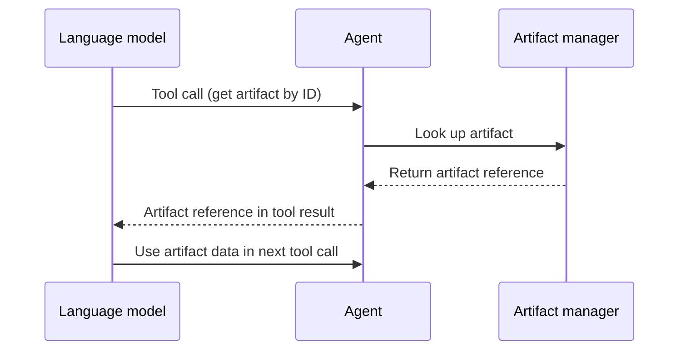

# Artifact architecture

## Overview

Artifacts are structured records of data produced during a conversation from operations such as search, create, edit, and media generation. The artifact design is intended to encourage or enforce local-first execution by providing references (artifact IDs) instead of full payloads when possible, helping protect privacy and reduce token-limit pressure.

## How it works

### Artifact lifecycle

1. An agent executes a tool (search, create, edit, etc.) and produces a result.
2. The result is wrapped into a typed artifact with a unique ID.
3. A serializer converts the artifact into a storable format.
4. The serialized artifact is appended to the conversation note inside a special code block.
5. The artifact is also added to an in-memory cache for fast access during the session.
6. When the conversation is reopened, artifacts are deserialized from the note and loaded back into memory.

### Artifact types

Each artifact has a type that determines its structure and how it is serialized. The following types exist:

| Type                     | Description                                                     | Revertable |
| ------------------------ | --------------------------------------------------------------- | ---------- |
| Search results           | Results from a vault search operation                           | No         |
| Created notes            | Paths of newly created files                                    | Yes        |
| Read content             | Content read from notes, including embedded images              | No         |
| Content update           | Extraction details for a content update                         | No         |
| Generated content        | Text content generated by the language model                    | No         |
| Media results            | Paths to generated audio or image files                         | No         |
| Extraction result        | Parsed query and command extraction                             | No         |
| Deleted files            | Metadata referencing files that were deleted                    | Yes        |
| Move results             | Pairs of original and destination paths from a move operation   | Yes        |
| Rename results           | Pairs of original and renamed paths                             | Yes        |
| Update frontmatter       | Original and updated frontmatter properties for affected files  | Yes        |
| List results             | Full list of file paths from a list operation                   | No         |
| Edit results             | Detailed change sets for each edited file                       | Yes        |

### Serialization

Artifacts are serialized into the conversation note using a code block format. A serializer converts the artifact into a string representation, and a matching deserializer reconstructs it when reading the conversation back.

Different artifact types use different serialization strategies:

- **Default (JSON)** — Most artifacts are serialized as JSON inside a special code block. The full artifact data is stored directly.
- **Search results** — Only document IDs, scores, and matched keywords are stored. The full document data is resolved from the document store on deserialization. This keeps the serialized size small even for large result sets.
- **Generated content** — Only a message reference ID is stored. The actual content is resolved from the conversation message on deserialization, avoiding duplication.
- **Read content** — Serialized as JSON, but on deserialization, image paths are extracted from the content for downstream use.
- **Composite** — Some types chain multiple serializers together. For example, search results first transform the data (extracting IDs and scores), then the result is wrapped in the JSON code block format. Deserialization applies the chain in reverse.

### Referencing artifacts by ID

Artifacts are not always provided in full to the AI. Instead, the AI receives artifact IDs and retrieves full artifact data on demand through dedicated tools.

For large outputs such as search and list operations, this behavior is intentional: the system avoids injecting full payloads into model context and pushes the AI to continue the task through local tools and local data access. This keeps token usage under control.

Two retrieval tools are available to the AI:

- **Get most recent artifact** — Returns the most recent revertable artifact from the conversation. Used primarily for revert operations where the user wants to undo the last action.
- **Get artifact by ID** — Returns a specific artifact when the AI already knows its ID. Used when the AI needs to reference a particular earlier result.

Both tools return an artifact reference (not the full content) back into the conversation history. The agent then resolves the reference to access the underlying data.

### Local-first examples

The following examples show how artifacts help the agent continue work locally instead of requesting large payloads again:

1. **Search then edit specific files**
   - The agent runs a search and stores results as an artifact.
   - The model receives the artifact reference, not full file contents.
   - The agent resolves file paths locally from that artifact and runs edit operations only on selected files.
   - Result: less data sent to the model, and file operations stay local.

2. **List files then perform batch updates**
   - A list operation produces a list-results artifact.
   - The agent keeps the full list locally and passes only the artifact reference into the model flow.
   - Follow-up steps (rename, move, edit, metadata updates) use local tool execution against the stored list.
   - Result: avoids repeatedly sending long file lists to the model.

3. **Revert the latest operation**
   - A create, move, rename, delete, or edit action stores a revertable artifact.
   - When the user asks to undo, the agent retrieves the most recent revertable artifact reference.
   - The revert tool executes locally from artifact data.
   - Result: undo is deterministic and does not depend on the model remembering previous outputs.

### Conversation scoping

Each conversation has its own artifact manager instance, identified by the conversation title. Artifacts from one conversation are completely invisible to other conversations. The manager maintains a registry of instances keyed by conversation title, so multiple open conversations can each track their own artifacts independently.

### Persistence and transparency

Artifacts are serialized directly into the conversation note as part of the conversation content. This means:

- They are visible to the user as part of the conversation history.
- They persist across app restarts since they are stored in the note file itself.
- They can be reconstructed from the note content at any time by re-reading and deserializing the stored blocks.

An in-memory cache provides fast access during the session. The cache is kept in sync with the note content — if the note is modified externally and the cache becomes stale, the system detects the mismatch and refreshes the cache automatically.

## Key decisions

- **ID-based referencing over full content.** Passing only artifact IDs to the AI keeps the context window lean. The AI retrieves full data only when it actually needs it, which is critical for large artifacts like search results with hundreds of matches.
- **Local-tooling-first execution.** Large artifacts such as search and list results are often provided as references or compact payloads, not full data blocks. This enforces a workflow where the AI must use tools to navigate local state and complete tasks.
- **Conversation-scoped isolation.** Keeping artifacts tied to a single conversation prevents cross-contamination of state and simplifies cleanup. When a conversation is done, its artifacts live only in that note.
- **Serialization directly in the note.** Writing artifacts into the conversation note as visible blocks makes the system transparent. The user can inspect exactly what data was produced, and no external database or hidden storage is needed.
- **Type-specific serializers.** Different artifact types have very different storage needs. Search results benefit from storing only IDs (resolved later from the document store), while simple artifacts like created notes can be stored as-is. The serializer architecture allows each type to optimize independently.
- **Composite serializer chaining.** Chaining serializers allows combining concerns (data transformation and formatting) without coupling them. This makes it straightforward to add new serialization strategies without modifying existing ones.
