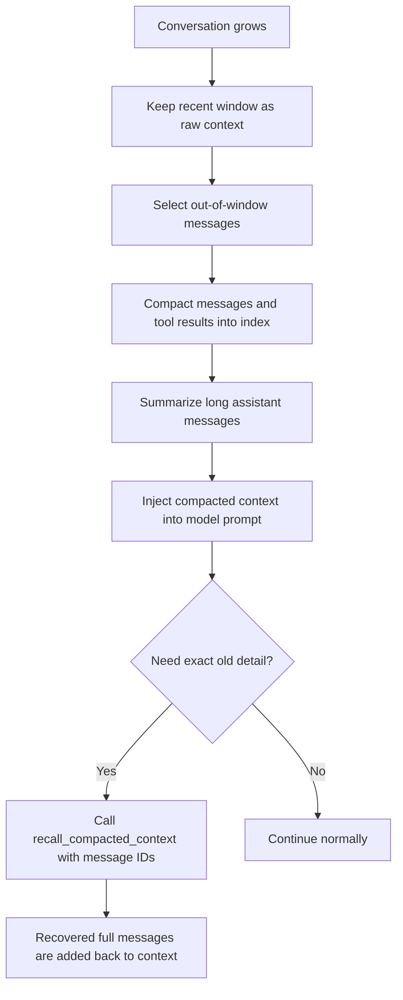

# Conversation compaction

## Overview

Conversation compaction is a memory strategy for long conversations. It reduces prompt size while preserving the ability to recover earlier details when needed.

The system keeps a recent message window in raw form and compacts older messages into a structured index. This allows Steward to stay context-aware across long sessions without sending the full history on every model call.

The design goal is simple:

- Keep recent context fully visible.
- Keep older context lightweight but traceable.
- Keep chronological ordering so earlier and later events still align.
- Support targeted recall of one or many compacted messages.

## How it works

### High-level flow

### 1) Out-of-window messages are compacted in chronological order

When a conversation exceeds the active window, older entries are compacted and stored in a single ordered list.

- The compacted list includes both message entries and compacted tool-result entries.
- Entries are appended in the same order as original conversation progression.
- Chronological order is preserved even after compaction, so downstream reasoning still follows the original timeline.

This means Steward can see a compact timeline of prior context instead of losing it.

### 2) Tool call results are compacted to IDs and metadata

For supported tools, the system stores a compact representation instead of full payload output.

- The compact entry keeps the message ID, tool type, and minimal metadata.
- Metadata is tool-specific (for example, read paths, edited paths, renamed mappings, moved destination, generated artifact output path).
- Heavy payload content is excluded from prompt context.

Even though payload is compacted, each compacted entry still points back to the original message by ID, which enables full recall later.

### 3) Long messages are summarized

Long assistant-generated messages are processed asynchronously and converted into short summaries when they exceed a configured length threshold.

- Messages with meaningful content are summarized.
- Procedural filler can be removed from compacted text representation.
- Summaries preserve key entities and facts as much as possible.

This reduces context size while still keeping semantic value.

### 4) Recall one or many compacted messages

If exact historical detail is required, the agent can call `recall_compacted_context` with one or many message IDs.

- The tool accepts multiple IDs in one call.
- IDs can be passed with or without the `msg-` prefix.
- The response returns recovered messages plus a list of missing IDs if some messages cannot be found.

This gives Steward a precise "on-demand memory fetch" path for details that were compacted or summarized.

## What is stored in compacted memory

Compacted memory is stored as structured conversation metadata and includes:

- Ordered compacted entries (messages and tool results).
- Boundary markers for the latest compacted point.
- Compaction timestamp and schema version.

Each entry remains addressable by message ID, which is the anchor for targeted recall.

## Use cases

### Use case 1: List all names and places from earlier notes, even outside the active window

Scenario:

- The user has a long conversation where many notes were read over time.
- Earlier note reads are out-of-window and only compacted references remain in prompt context.
- The user asks: "List all names and places mentioned in all notes we read so far."

How Steward handles it:

1. Steward scans compacted context and identifies relevant message IDs (especially earlier read results).
2. Steward calls `recall_compacted_context` with those IDs in one or more batches.
3. Steward extracts names and places from recovered full content.
4. Steward returns a complete consolidated list.

Result:

- Steward can answer across the full conversation history, not just the recent window.

### Use case 2: Provide exact quotes that are not present in summaries

Scenario:

- A long assistant response was summarized during compaction.
- The user asks for the exact original quote or exact generated paragraph.

How Steward handles it:

1. Steward identifies that compacted content is summarized and not quote-safe.
2. Steward recalls the original message by ID using `recall_compacted_context`.
3. Steward extracts the exact text span from the recovered original.
4. Steward returns the quote verbatim.

Result:

- Steward can provide exact wording even when compacted context only contains a summary.

## Key decisions

- **Chronological compact index** keeps compacted memory understandable and traceable.
- **Metadata-first tool compaction** keeps prompt size small while retaining recovery pointers.
- **Asynchronous summarization** avoids blocking primary user interaction flow.
- **Explicit recall tool** ensures exactness is retrievable instead of guessed.

## Needs improvement

- Smarter automatic ID selection for recall in highly dense histories.
- Better grouping for bulk recall when many related compacted entries exist.
- Stronger safeguards to automatically trigger recall before quote-level answers.
