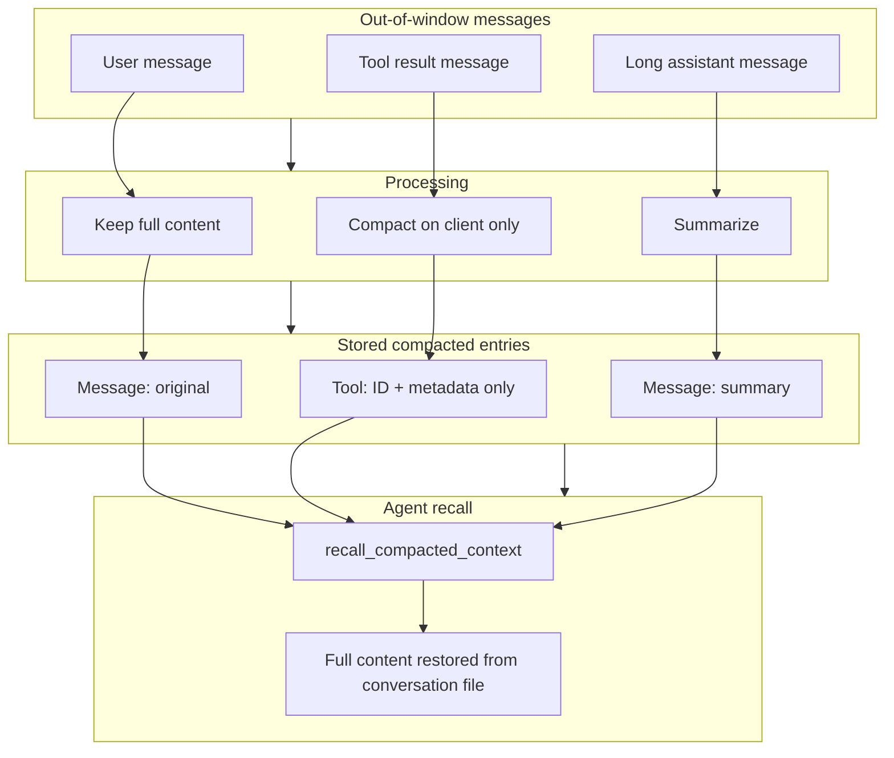
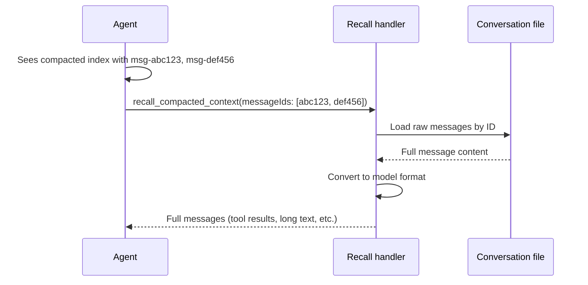

# Conversation compaction

## Overview

Conversation compaction reduces the amount of history sent to the language model while preserving the ability to recall any message in full. Messages outside a sliding window are compacted or summarized so the agent can operate on long conversations without hitting context limits. Compacted entries remain in chronological order. The agent can retrieve full content for any compacted message using a dedicated recall tool.

## How it works

### Message classification and treatment

Out-of-window messages are processed one by one and treated differently based on type:

- **Tool result messages** — Compacted on the client side only. The full tool output stays in the conversation file. The context sent to the model contains only the tool name, IDs, and lightweight metadata (e.g. file paths read, paths edited). This metadata is enough for the agent to decide when to recall.
- **Long assistant-generated messages** — Summarized asynchronously. The summary replaces the full text in the compacted index. The original content remains in the conversation file and is available on recall.
- **User messages and short assistant messages** — Stored in full in the compacted index. No summarization.

All compacted entries are appended to a single ordered list, so the timeline is preserved.

### Compaction flow



### Decision chart

| Message type | Treatment | What the agent sees | Full content |
|--------------|-----------|---------------------|--------------|
| Tool result | Compact on client only | Tool name + metadata (IDs, paths, etc.) | Available via recall |
| Long assistant-generated | Summarize | 1–3 sentence summary | Available via recall |
| User or short assistant | Keep original | Full text | Already in context |

### Recall flow

When the agent needs details from a compacted message, it invokes the recall tool with one or more message IDs from the compacted index. The system loads the raw messages from the conversation file and returns them in the same format as live history. The agent receives the full content — including exact quotes, file contents, and tool outputs — that were not included in the summarized or compacted preview.



## Key decisions

- **Client-side only for tool results** — Tool outputs are never summarized by the model. They are reduced to metadata (paths, IDs) locally. The full output stays in the conversation file. This avoids loss of accuracy and keeps recall deterministic.
- **Chronological order** — Messages and tool results are stored in a single ordered array. The agent always sees the timeline as it happened.
- **Async summarization** — Long assistant messages are summarized in the background. The main agent flow is not blocked.
- **Recall from source** — Recall always reads from the conversation file, not from any cached summary. The agent gets the original content.

## Use cases

### List all names and places across previously read notes

In a long conversation, the agent has read dozens of notes that are now out of window. The compacted index shows entries like:

```
Assistant (msg-xyz789, compacted): [content_reading] {"files":[{"path":"Project/Meeting.md","name":"Meeting.md"},...],"note":"3 more path(s) omitted; use recall_compacted_context for full list"}
```

The agent needs to collect all person names and place names mentioned in those notes. It calls the recall tool with the relevant message IDs. The full content of each content-reading result is returned, and the agent can extract the requested entities.

### Provide exact quotes or generated content not in the summary

A long assistant reply was summarized to: "Explained the three-step process for setting up the workflow and listed the main requirements." The user asks: "What was the exact second step you mentioned?" The summary does not contain that detail. The agent calls the recall tool with that message ID, receives the full original text, and returns the exact quote.

### Verify what was edited in a previous step

The compacted index shows: `Assistant (msg-abc123, compacted): [edit] {"editedPaths":["Tasks/Todo.md"],"note":"2 more path(s) omitted"}`. The user asks whether a specific file was modified. The agent recalls that message to get the full edit output, including the exact changes made.

### Cross-reference information from multiple compacted sources

The user asks a question that requires combining information from several notes read earlier in the conversation. The agent identifies the relevant compacted message IDs from the index, recalls them in a single call, and uses the full content to answer.

## Important notes

- The compacted index is the agent’s primary view of older history. The agent must use the recall tool when it needs information not present in the index. Guessing or inventing content is incorrect.
- Message IDs in the index use the format `msg-<id>`. The recall tool accepts IDs with or without the `msg-` prefix.
- When the user deletes messages from the conversation, the compaction store is pruned to remove entries for those messages, keeping the index in sync with the conversation.
- Compaction runs before each agent request. Only messages outside the visible window are compacted; recent messages are always sent in full.
