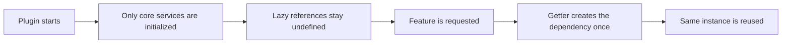

# Defer AI-SDK parse and lazy-load mechanism for fast startup

## Overview

To keep plugin startup around ~300ms, we avoid constructing non-critical dependencies at boot time and avoid **parsing and executing large third-party libraries** until a feature actually needs them.

Instead of eagerly creating everything, we:

- declare references for all optional dependencies up front (around 15 services and 30+ tool handlers),
- instantiate each dependency only when it is first accessed,
- reuse the same instance for subsequent calls.

Separately, heavy **vendor libraries** (`ai`, `@ai-sdk/*`, `ollama-ai-provider-v2`) are **not** part of the initial `main.js` parse path: they ship inside a **compressed payload** and run only after the first `getBundledLib(...)` call for a given module.

This keeps initialization work small while still giving full functionality during runtime.

## How it works



### Service-level lazy loading

```ts
// main.ts (simplified)
_searchService: SearchService;

get searchService(): SearchService {
  if (!this._searchService) {
    this._searchService = SearchService.getInstance(this);
  }
  return this._searchService;
}
```

### Handler-level lazy loading

```ts
// SuperAgentHandlers.ts (simplified)
private _vaultCreate: handlers.VaultCreate;

public get vaultCreate(): handlers.VaultCreate {
  if (!this._vaultCreate) {
    this._vaultCreate = new handlers.VaultCreate(this.getAgent());
  }
  return this._vaultCreate;
}
```

### Deferred third-party libraries (bundled chunk)

These packages are **externals** in the main `esbuild` build (`esbuild.config.mjs`): they are not pulled into the hot path of `main.js` as normal static imports. They are instead rolled into a **separate IIFE** from `src/bundled-libs-entry.ts`, **minified**, **LZ-compressed** to Base64, and emitted as `src/generated/bundledLibsPayload.ts`.

At runtime, `getBundledLib` in `src/utils/bundledLibs.ts`:

1. On **first** use of any bundled key, decompresses the payload and evaluates the chunk once (installing `__stewardBundledLibs` on `globalThis`).
2. Caches each requested module (`ai`, `openai`, `anthropic`, …) in memory for later calls.

So the cost of loading **Vercel AI SDK** and provider packages is paid **after** startup, typically when the first LLM or classifier path runs—not when Obsidian parses `main.js`.

**Regenerating the payload** (after changing `bundled-libs-entry.ts`, bumping those dependencies, or the build script):

```bash
npm run build:bundled-libs
```

Commit the updated `bundledLibsPayload.ts` so release builds stay reproducible. The default `npm run build` does **not** run this step every time.

**Runtime vs types:** Application code should use `getBundledLib('ai')` (and sibling keys) for **runtime** imports. **TypeScript types** may still be imported directly from `ai` or `@ai-sdk/*` (type-only or dev-time); those imports do not ship as executable code in the same way once the main bundle marks the packages external and loads logic through `getBundledLib`.

## Key decisions

- **Cache after first access**: avoids repeated construction cost and keeps behavior predictable.
- **Getter-based access**: enforces a single path for creation and retrieval.
- **Pay-as-you-go startup**: boot time stays low because unused features are not initialized.
- **Defer third-party parse/execute**: large AI SDK and provider code is not evaluated until the bundled chunk is first decompressed—reduces time-to-interactive for the plugin shell.

## Important notes

- Add new services/handlers using the same lazy getter pattern to keep startup performance stable.
- Avoid directly constructing heavy dependencies in startup lifecycle hooks unless strictly required.
- When adding a new npm module to the **bundled** set, wire it through `bundled-libs-entry.ts`, extend `BundledLibModules` / `BundledLibKey` in `bundledLibs.ts`, re-run `npm run build:bundled-libs`, and list it in the main esbuild **externals** so it is not double-bundled into `main.js`.
