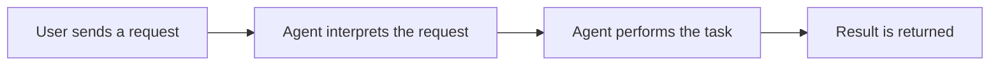

This guideline defines how agents should write technical documents in the `docs/technicals/` folder.

## Formatting

- Use sentence case for all titles and headings.
- Include diagrams where possible to illustrate flows, architecture, or relationships. Use Mermaid syntax for compatibility with Obsidian.
- Keep paragraphs short and focused. Prefer bullet points over long prose when listing behaviors or rules.

## Language and tone

- Write in plain, direct language. Avoid exaggerated or promotional words.
- Should not include code snippets, function names, class names, or variable names (Unless asked by the user). The document should be understandable by anyone with a technical background, even if they have never seen the codebase.

## Structure

A technical document should generally follow this structure, though not every section is required for every document:

1. **Overview** — A brief summary of what the feature or system does and why it exists.
2. **How it works** — A step-by-step or flow-based explanation of the behavior. Include diagrams here when applicable.
3. **Key decisions** — Explain any non-obvious design choices and the reasoning behind them.
4. **Limitations** — Known constraints, edge cases, or scenarios that are not yet supported.
5. **Needs improvement** — Areas that are functional but could be better. Be specific about what and why.
6. **Important notes** — Anything a reader should be aware of that doesn't fit elsewhere, such as assumptions, dependencies, or risks.

## Diagrams

When including diagrams, use Mermaid blocks. Keep them simple and label each step clearly.

Prefer flowcharts for processes, sequence diagrams for interactions between components, and block diagrams for architecture overviews.
