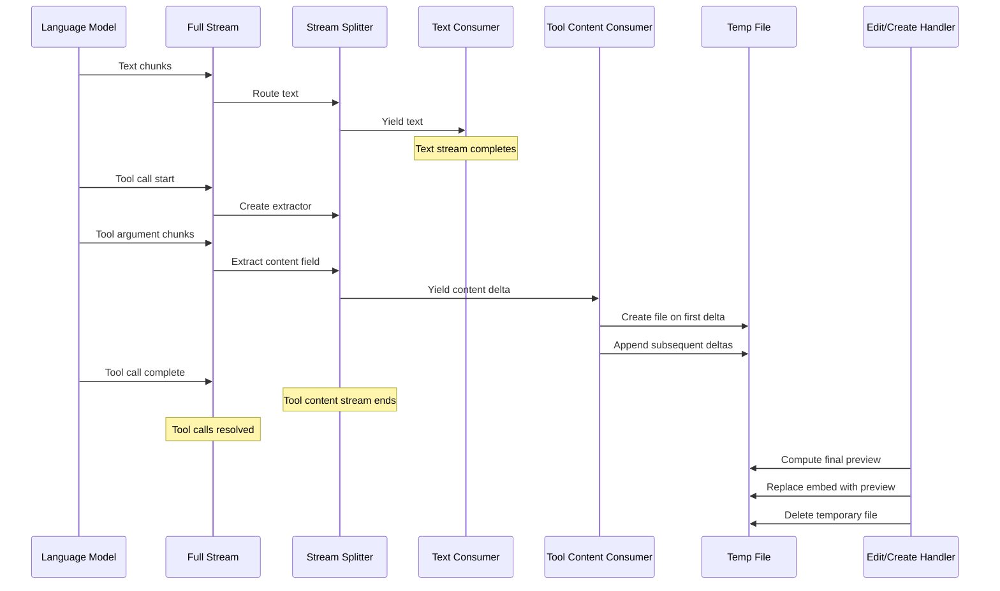

# Tool call content streaming

## Overview

This feature streams the content field of tool call arguments in real-time to provide immediate visual feedback during file edits and creation. Without it, users would wait several seconds without seeing any preview while the language model generates content. The system extracts and displays the content field incrementally as the model generates it, writing to a temporary file embedded in a preview callout.

## How it works

The streaming process involves four main stages: stream splitting, content extraction, temporary file management, and preview replacement.

### Stream splitting

The language model produces a single output stream containing text, reasoning, and tool call data. Since this stream can only be consumed once, the system splits it into two concurrent streams:

- A text stream that yields the agent's explanation and reasoning
- A tool content stream that yields extracted content field values

Both streams read from the same underlying stream using a shared queue. As chunks arrive, they are routed based on type. Text and reasoning chunks go to the text stream. Tool call chunks are processed by the content extractor, and the extracted content is pushed to the tool content stream.

The text stream completes first when the model finishes its explanation. The tool content stream continues running during tool call generation.

### Content extraction

The content extractor is a stateful parser that processes partial JSON from the streaming tool arguments. It tracks JSON structure including nesting depth, string boundaries, escape sequences, and key names.

For edit operations, the extractor looks for objects where the mode field equals replace by lines. It then extracts the content field from those objects. For file creation operations, it extracts the content field from each file entry unconditionally.

The extractor decodes JSON escape sequences including quotes, backslashes, newlines, tabs, and unicode escapes. This ensures the streamed content matches what will eventually be in the final file.

### Temporary file management

When the first content chunk arrives, the system creates a temporary file in the vault at a path like Steward/tmp/stw_stream_abc123.md. It renders a preview callout containing an embedded link to this file. As more content arrives, it appends the decoded text to the temporary file. The embedded file view updates automatically in the note.

Once the tool call completes and the handler processes the operation, the temporary file is deleted.

### Preview replacement

After the tool call completes, the handler receives both the final tool arguments and information about the streamed temporary file. For operations that used streaming, the handler computes the final preview content, then replaces the temporary file embed with the computed preview. For operations that did not use streaming, the handler renders the preview normally.

This replacement ensures the final preview shows proper formatting, line numbers, and change indicators rather than just raw content.

## Data flow

## Key decisions

### Why split the stream instead of buffering

The system could buffer all text before starting the tool content stream, but this would delay the preview. By splitting the stream, text and tool content are processed concurrently. The text stream finishes first, then the tool content stream continues while the user reads the explanation.

### Why use temporary files instead of direct callout updates

Updating a callout repeatedly for every small content chunk would cause excessive file writes and UI redraws. Temporary files with embedded links allow the content to accumulate in one file while the callout remains unchanged. The embed view updates automatically without rewriting the conversation note.

### Why require mode checking for edit operations

The edit tool supports multiple modes including insert, delete, and replace by lines. Only replace by lines provides a complete content field suitable for streaming. Other modes require computing a preview by fetching file content and applying operations. The extractor checks the mode field to avoid extracting content from operations that cannot be streamed.

### Why use a stateful parser instead of a JSON library

Standard JSON parsers require complete objects. Tool arguments arrive as a stream of partial text like `{"operati`, `ons":[{"mode":"repl`, `ace_by_lines","content":"he`. A stateful character-by-character parser can extract field values before the JSON is complete. It tracks structure and escaping to correctly handle content that contains JSON special characters.

## Scope

This feature applies to two tools:

- Edit tool, only for replace by lines mode where the content field contains the complete replacement text
- Vault create tool for the content field of each new file entry

Other edit modes like insert at line and replace by pattern are excluded because they require fetching existing file content to compute a preview. The streaming content alone is insufficient.

## Limitations

### Unicode handling in partial buffers

The unicode escape decoder requires four hex digits after the backslash u sequence. If a chunk boundary splits a unicode escape, the decoder returns a placeholder until the remaining digits arrive in the next chunk. This works for most cases but could produce incorrect output if the stream ends mid-escape.

## Important notes

### Temporary file location

All temporary streaming files are created under Steward/tmp/ in the vault. This folder is created automatically if it does not exist. On plugin unload, the system attempts to delete all files in this folder matching the naming pattern. If the plugin crashes or is forcibly terminated, temporary files may remain until the next plugin load.

### Concurrency with multiple tool calls

The current design handles one streamed tool call at a time. If the language model generates multiple edit or create tool calls simultaneously, each will stream to its own temporary file and render its own callout. The handlers process them sequentially after all tool calls complete.

### Extract logic is tool-specific

The content extraction logic is configured per tool. The edit tool uses a mode-aware extractor, while the create tool uses a simple content extractor. If new tools need streaming support, they must implement their own extractor that matches their argument structure.
