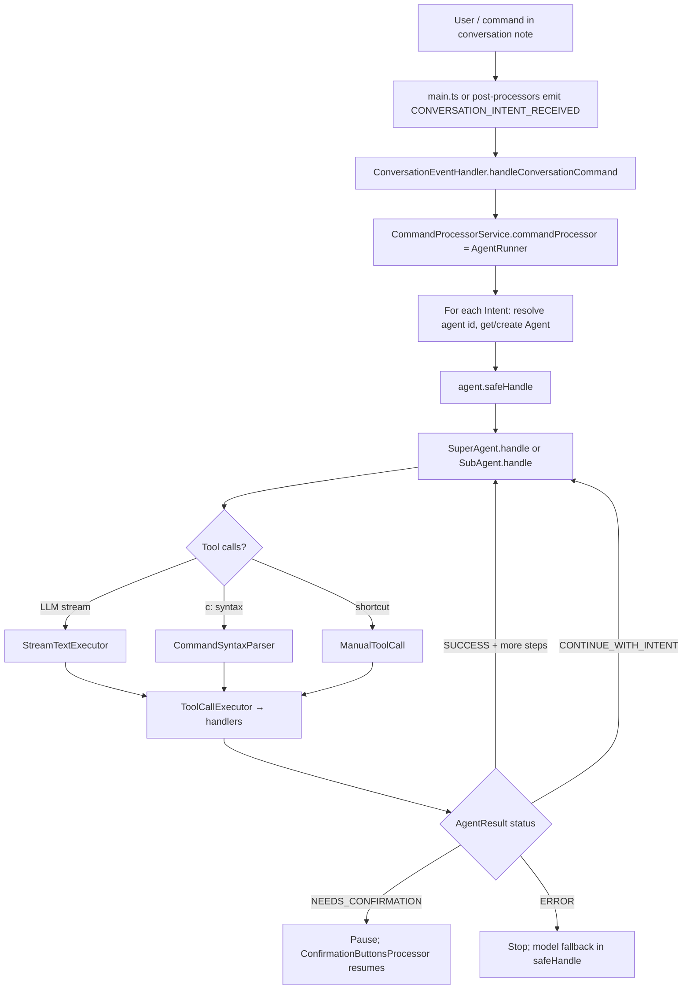
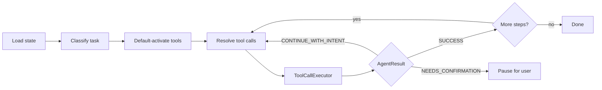

# src/solutions/commands/ — Command & Agent System

The core of Steward. This folder defines intents, agents, tools, handlers, and the full command processing pipeline. The `agents/` subfolder is the most complex structure in the project.

See also [docs/technicals/Agents architecture.md](../../../docs/technicals/Agents%20architecture.md) (note: UDC section is slightly stale — UDCs route through SuperAgent, not a separate agent class).

## Top-Level Layout

```
src/solutions/commands/
├── Agent.ts                 # Abstract base agent (safeHandle, handle, buildCorePrompt)
├── types.ts                 # Intent, AgentResult, AgentHandlerParams, IntentResultStatus
├── IntentProcessor.ts       # Interface implemented by AgentRunner
├── ToolRegistry.ts          # Tool metadata, prompt sections, companion tools
├── toolNames.ts             # ToolName enum
├── index.ts                 # Re-exports IntentProcessor
├── tools/                   # AI SDK tool schemas (editContent, activateTools, types)
├── command-syntax-parser/   # c:tool --args bypass for LLM
└── agents/                  # Agent subsystem (see below)
```

## Key Abstractions

| Abstraction              | File                 | Role                                                                          |
| ------------------------ | -------------------- | ----------------------------------------------------------------------------- |
| `Intent` / `AgentResult` | `types.ts`           | Rich result union drives pause/continue/stop                                  |
| `Agent`                  | `Agent.ts`           | Abstract base: `handle`, `buildCorePrompt`, `getValidToolNames`, `safeHandle` |
| `IntentProcessor`        | `IntentProcessor.ts` | Contract for `AgentRunner.processIntents`                                     |
| `ToolRegistry`           | `ToolRegistry.ts`    | Prompt text, categories, companion tool expansion                             |
| `ToolName`               | `toolNames.ts`       | Enum of all tool identifiers                                                  |

## agents/ Layout

```
src/solutions/commands/agents/
├── AgentRunner.ts             # Intent dispatch loop, pause/resume state
├── AgentFactory.ts            # createAgentFromConfig()
├── AgentConfig.ts             # Zod schema for config-driven agents
├── defaultAgents.ts           # DEFAULT_AGENT_CONFIGS
├── intentHelpers.ts           # parseIntentType, extractToolsFromQuery
├── AgentHandlerContext.ts     # Handler dependency interface
├── HandlerInvocationContext.ts # Per-turn handler ctx (serialize tool invocations)
├── agentTools.ts              # Super/sub tool sets + lazy tool loading
├── SuperAgent/SuperAgent.ts   # Primary agent
├── SubAgent/SubAgent.ts       # Delegated worker agent
├── DataAwarenessAgent/        # Batch LLM over artifact file lists
├── ConversationTitleAgent/    # Fire-and-forget title generation
├── CompactionSummaryAgent/    # Async message compaction summaries
├── handlers/                  # One class per tool (~35 handlers)
├── components/                # Mixins: stream, execute, manual shortcuts
└── middleware/                # Tool handler chain (guardrails, etc.)
```

## Registered Agents

From `defaultAgents.ts`:

| Config `id`                        | Factory    | Role                                            |
| ---------------------------------- | ---------- | ----------------------------------------------- |
| `super` (default)                  | `super`    | Full SuperAgent, all tools, can spawn subagents |
| `subagent`                         | `subagent` | Narrow delegated worker                         |
| `search`, `speech`, `image`, `new` | `super`    | SuperAgent with pre-scoped tools                |
| `>`                                | `super`    | Shell/CLI intent (`/>` syntax)                  |
| `widget_actor`                     | `super`    | Widget interaction (`WIDGET_ACTION` only)       |
| `title`, `compaction_summary`      | standalone | Not routed via `AgentRunner` intent loop        |

**UDC routing:** User-defined command names resolve to **`super`** in `AgentRunner.resolveAgentId()`. Expansion happens inside **`RunCommand`** handler + **`TodoList`**, not a separate UDC agent class.

## Intent Processing Flow



**Entry chain:**

1. `src/main.ts` — slash command from editor → `Events.CONVERSATION_INTENT_RECEIVED`
2. `src/services/ConversationEventHandler.ts` — listens, calls `commandProcessor.processIntents`
3. `src/services/CommandProcessorService.ts` — wraps `AgentRunner` + content validation
4. `src/solutions/commands/agents/AgentRunner.ts` — sequential intent processing, pause/resume
5. `src/solutions/commands/Agent.ts` — `safeHandle`: sanitize, load model/tools/prompts, fallback, confirmation UI

## SuperAgent Lifecycle

1. **Load state** — `activeTools` from params + frontmatter + defaults; model from intent/frontmatter/`ModelFallbackService`
2. **Classify task** — intent type, CLI session (`>`), `getClassifier()` (static/prefix/cluster), or infer from active tools
3. **Default-activate tools** — `TASK_TO_TOOLS_MAP` + companion expansion via `ToolRegistry`
4. **Resolve tool calls** (priority order):
   - Resume batch (`options.toolCalls`)
   - `CommandSyntaxParser.parseAndConvert` (`c:read`, `c:edit`, …)
   - `ManualToolCall` (help, stop, search with clear query, etc.)
   - `StreamTextExecutor.executeStreamText` (LLM + tools)
5. **`ToolCallExecutor.executeToolCalls`** — dispatch to handler map; middleware chain includes guardrails
6. **Multi-step loop** — up to 20 steps; UDC todo steps via `TodoList`; step-limit confirmation; `createStepProcessedQuery` strips processed prefix
7. **Special statuses** — `CONTINUE_WITH_INTENT` (RunCommand UDC expansion), `NEEDS_CONFIRMATION`, vault-durable `ask_user_preference`, deferred `btw:` side questions



## SubAgent

- Same handler map via **`Handlers`** mixin, but **`GenerateTextExecutor`** instead of streaming
- Smaller tool set (`SUBAGENT_TOOL_NAMES` in `agentTools.ts`)
- Spawned by **`SpawnSubagent`** handler + **`SubagentSpawnService`**
- `includesDelegatedCatalogSections(): false` — task prompt comes from parent via `intent.systemPrompts`

Mixins: `Handlers`, `ToolCallExecutor`, `GenerateTextExecutor`

## Handler Catalog

Each handler: class taking `AgentHandlerContext`, implements `handle(ctx: HandlerInvocationContext, { toolCall, … })`.

Registration: **`components/Handlers.ts`** → `getToolHandlerMap()` maps `ToolName` → lazy handler instance.

| Group     | Handlers                                                                                                                                 |
| --------- | ---------------------------------------------------------------------------------------------------------------------------------------- |
| Vault     | `VaultCreate`, `VaultList`, `VaultDelete`, `VaultCopy`, `VaultMove`, `VaultRename`, `VaultUpdateFrontmatter`, `VaultGrep`, `VaultExists` |
| Content   | `ReadContent`, `EditHandler`                                                                                                             |
| Search    | `Search`, `SearchMore`, `BuildSearchIndex`                                                                                               |
| Revert    | `RevertLatestQuery`                                                                                                                      |
| Media     | `Speech`, `Image`                                                                                                                        |
| Widget    | `ShowWidget`, `WidgetActionHandler`                                                                                                      |
| Workflow  | `TodoList`, `RunCommand`, `SpawnSubagent`, `SwitchAgentCapacity`, `ActivateToolHandler`, `Dynamic`                                       |
| Artifacts | `GetMostRecentArtifact`, `GetArtifactById`, `RecallCompactedContext`                                                                     |
| User      | `UserConfirm`, `Help`, `Stop`, `ThankYou`, `NewSession`                                                                                  |
| CLI/MCP   | `CliHandler`, `McpToolHandler`                                                                                                           |

## Mixin Components

Applied via `applyMixins()` from `src/utils/applyMixins.ts`.

| Mixin                       | File                                      | Role                                     |
| --------------------------- | ----------------------------------------- | ---------------------------------------- |
| `Handlers`                  | `components/Handlers.ts`                  | Lazy handler instances + tool map        |
| `StreamTextExecutor`        | `components/StreamTextExecutor.ts`        | LLM streaming, history, tool extraction  |
| `GenerateTextExecutor`      | `components/GenerateTextExecutor.ts`      | Non-streaming LLM (SubAgent)             |
| `ToolCallExecutor`          | `components/ToolCallExecutor.ts`          | Run tool calls, middleware, batch resume |
| `ManualToolCall`            | `components/ManualToolCall.ts`            | Skip LLM for known patterns              |
| `ToolContentStreamConsumer` | `components/ToolContentStreamConsumer.ts` | Stream large tool output to temp files   |
| `SystemPromptComposer`      | `components/SystemPromptComposer.ts`      | Compose prompts for executors            |
| `ToolIntentResolution`      | `components/ToolIntentResolution.ts`      | Resolve tool-related intents             |

**SuperAgent mixins:** `Handlers`, `ToolContentStreamConsumer`, `ManualToolCall`, `StreamTextExecutor`, `ToolCallExecutor`

## Auxiliary Agents (Not in Intent Loop)

| Agent                    | Invoked from                                                          |
| ------------------------ | --------------------------------------------------------------------- |
| `ConversationTitleAgent` | `ConversationEventHandler.generateConversationTitle`                  |
| `CompactionSummaryAgent` | `CompactionTokenService`                                              |
| `DataAwarenessAgent`     | Vault handlers (e.g. `VaultRename`) for batch LLM over artifact paths |

## Architecture Decisions

1. **Mixin composition over deep inheritance** — SuperAgent/SubAgent gain behavior via mixins
2. **Lazy handler instantiation** — handlers created on first access in `Handlers` getters
3. **Config-driven agent registry** — `DEFAULT_AGENT_CONFIGS` + `AgentFactory`; `AgentRunner` caches instances
4. **Single SuperAgent for most intents** — specialized “agents” (search/speech/image) are SuperAgent + pre-scoped tools
5. **UDC integrated into SuperAgent** — `RunCommand` expands steps; `TodoList` orchestrates
6. **Tool handler middleware chain** — `createToolHandlerChain` + guardrails middleware before handler body
7. **Companion tools** — activating one tool auto-expands related tools (`ToolRegistry.expandWithCompanionTools`)
8. **Command syntax bypass** — `c:tool --args` skips classification and LLM (`CommandSyntaxParser`)
9. **Artifacts as source of truth** — search results, edits, deletes stored for revert, pagination (`search_more`), DataAwareness batches
10. **Frontmatter-driven session state** — `tools`, `allowed_tools`, `model`, `lang`, `udc_command`, todo list in conversation note YAML

## How To: Add a New Tool

1. Add enum value to `ToolName` in `toolNames.ts`
2. Add AI SDK tool schema in `tools/` if LLM-facing
3. Register metadata in `ToolRegistry.ts` (prompt section, category, companions)
4. Create handler class in `handlers/MyTool.ts` implementing `StandardToolHandler`
5. Export from `handlers/index.ts`
6. Add lazy getter + map entry in `components/Handlers.ts` `getToolHandlerMap()`
7. Add to `agentTools.ts` tool sets if needed (super/sub/default activation)
8. Co-locate `MyTool.test.ts`

## How To: Register a New Config-Driven Agent

1. Add entry to `DEFAULT_AGENT_CONFIGS` in `defaultAgents.ts` with `id`, `factory`, optional `tools`
2. If intent-routed, add `id` to `INTENT_ROUTING_IDS` in `AgentRunner.ts`
3. Implement factory branch in `AgentFactory.ts` if new factory type
4. Add tests in `AgentFactory.test.ts`

## Service Connections

| From commands             | To services                                                                                                                                                                                        |
| ------------------------- | -------------------------------------------------------------------------------------------------------------------------------------------------------------------------------------------------- |
| `AgentRunner`             | `ConversationRenderer`, `ModelFallbackService`, `UserDefinedCommandService`, `NoteContentService`                                                                                                  |
| SuperAgent / handlers     | `LLMService`, `ContentReadingService`, `VaultService`, `SkillService`, `GuardrailsRuleService`, `CliSessionService`, `WidgetService`, `SubagentSpawnService`, `ArtifactManagerV2`, `SearchService` |
| `RunCommand` / `TodoList` | `UserDefinedCommandService`                                                                                                                                                                        |

## See Also

- [Root AGENTS.md](../../../AGENTS.md)
- [src/solutions/AGENTS.md](../AGENTS.md) — artifact, search, pty-companion overview
- [src/services/AGENTS.md](../../services/AGENTS.md) — business logic consumed by handlers
- [docs/technicals/Technical guideline for Agents.md](../../../docs/technicals/Technical%20guideline%20for%20Agents.md)
