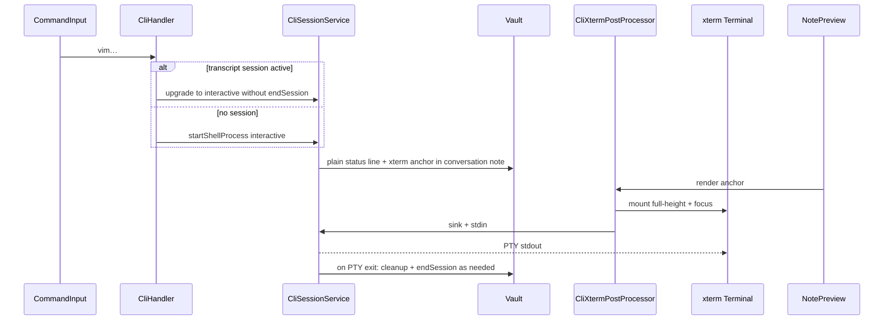

# xterm integration for interactive CLI (`cliMode: 'interactive'`) — revised

## Context (current architecture)

- Interactive shells use `[createRemotePtySession](src/solutions/pty-companion/client.ts)` + `[CliSessionService](src/services/CliSessionService/CliSessionService.ts)` with `cliMode: 'interactive'`.
- Custom reading-view behavior uses `[registerMarkdownPostProcessor](src/main.ts)` (e.g. `[CliTranscriptPostProcessor](src/post-processors/CliTranscriptPostProcessor.ts)`).
- PTY companion **already supports** `resize` over Socket.IO (`[server.ts](src/solutions/pty-companion/server.ts)` lines 139–147); the **client shim does not expose it yet**.
- **Dependencies:** `@xterm/xterm` and `@xterm/addon-fit` are **already installed** (`[package.json](package.json)`); verify CSS is bundled if missing.

## Vault paths (no dot prefix)

- **Do not** use dot-prefixed folder or file names (e.g. `.cli-terminal`); Obsidian ignores them.
- Use normal paths under `stewardFolder` (or existing Conversations layout), e.g. `Steward/Cli terminals/session-<id>.md` or a dedicated **non-hidden** subfolder name—product choice, but **never** leading `.` on segments.

## UX requirements

### 1. Conversation note status (interactive start)

When entering interactive mode, **append a short plain markdown** message to the conversation note (interactive terminal opening). Use **plain markdown only** (paragraph, callout, etc.)—**not** inside a `

```cli-transcript` **or any fence** that existing tooling strips or treats as a stream anchor.

### 2. Terminal opens from **command input** + **vim**, at **that** place in the note

- The trigger is **not** limited to a literal `/>` token alone.
- When the user submits a **command that starts with `vim`** (same rule as today’s interactive routing, e.g. trim + case-insensitive prefix) **via the command input**, the plugin should **open the terminal anchored at the location associated with that command** in the **conversation note** (wherever the steward pipeline records that turn)—this applies to **any** UI that feeds the same command input, **not only** `[StewardChatView](src/views/StewardChatView.ts)`.
- A **post-processor** still mounts xterm when preview renders the marker block / token written into the note for that session.

(Optional: keep or drop a short `**/>`** marker as an implementation detail for the embed point; if kept, it is **in addition\*\* to the vim-from-input flow, not the only path.)

### 3. Transcript → vim: **do not close the current session**

- If the **current** CLI session is **transcript** (`child_process`) and the user submits `**vim…`\*\* from the command input:
  - **Start interactive** (PTY, `cliMode: 'interactive'`) **without** the usual full teardown (`endSession` + kill + map delete) that would “close” the session from the user’s perspective.
  - **Transition in place:** e.g. kill only the transcript `child` if it must be replaced, spawn PTY, update the same `CliSession` (or equivalent) so conversation title, stream marker, and note context stay continuous—**no** blank-slate session as if the user had started over.
- Contrast: today `[CliHandler.startSession](src/solutions/commands/agents/handlers/CliHandler.ts)` may call `endSession({ killProcess: true })` before `startShellProcess`; this path should **not** apply when **upgrading** transcript → interactive for the same conversation.

### 4. Full output from the start; no terminal-owned scroll

Same as before: one vertical flow, **page** scrolls; avoid a small fixed xterm box whose **only** scroll is internal. Dynamic rows / CSS / scrollback tradeoffs as needed.

### 5. Preview

xterm runs when markdown is rendered; user uses reading / live preview on the note where the anchor was written.

## Design (high level)



## Implementation sections

### 1. Styling

- xterm base CSS + plugin rules for full-buffer / page-scroll behavior in `[src/styles.css](src/styles.css)`.

### 2. PTY client: resize

- `[client.ts](src/solutions/pty-companion/client.ts)`: expose `resize(cols, rows)` on the shim; emit server `resize`.

### 3. CliSessionService + CliHandler

- `**upgradeTranscriptToInteractive` (or equivalent):\*\* if `getSession` exists, `cliMode === 'transcript'`, and new command is vim: dispose `child_process` child only as needed, create remote PTY, set `cliMode: 'interactive'`, reattach listeners, preserve `conversationTitle` / markers / `operationId` per product rules.
- **Fresh interactive:** unchanged except anchor + status writes.
- **Vault:** plain status line; **no** dot-prefixed paths for any helper note.
- **Interactive:** no raw PTY in `appendOutput`; use terminal sink from post-processor.

### 4. Post-processor

- `[CliXtermPostProcessor.ts](src/post-processors/CliXtermPostProcessor.ts)` + `[main.ts](main.ts)`: detect the anchor written for a session (language token / data attribute + conversation id); mount xterm; bind stdin/stdout; cleanup on exit/unload.

### 5. Edge cases

- Session ended before preview: static message in host.
- **Security:** no PTY token in notes; opaque ids only.

## Files likely touched

| Area                           | Files                                                                                                                                 |
| ------------------------------ | ------------------------------------------------------------------------------------------------------------------------------------- |
| PTY client                     | `[src/solutions/pty-companion/client.ts](src/solutions/pty-companion/client.ts)`                                                      |
| Session + upgrade              | `[src/services/CliSessionService/CliSessionService.ts](src/services/CliSessionService/CliSessionService.ts)`                          |
| Handler                        | `[src/solutions/commands/agents/handlers/CliHandler.ts](src/solutions/commands/agents/handlers/CliHandler.ts)`                        |
| Command input / note injection | `[src/services/CommandInputService.ts](src/services/CommandInputService.ts)` or renderer paths that insert into the conversation note |
| Post-processor                 | new `CliXtermPostProcessor.ts`, `[src/main.ts](src/main.ts)`                                                                          |
| Styles                         | `[src/styles.css](src/styles.css)`                                                                                                    |

## Out of scope (follow-ups)

- Optional plain-text log on exit.
- Performance caps for unbounded row growth.
